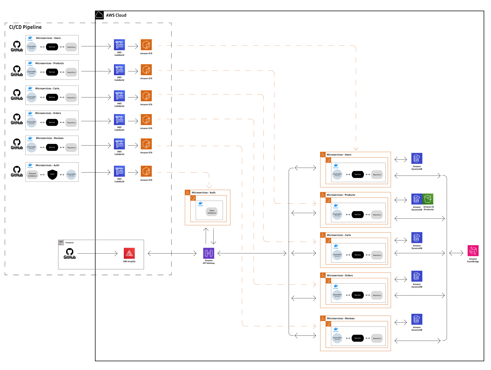

# AWS-powered Full-Stack E-Commerce with Microservices & Serverless Backend

## Demo

https://www.siwoo-ecommerce.com/

## Development Note & History

https://medium.com/@siwoo.jg/list/ecommerce-website-sideproject-028ed604f728

## AWS Architecture

## Features

- Scalable and serverless microservices backend architecture with [AWS Lambda](https://aws.amazon.com/lambda/)
- CI/CD and automated deployment via [AWS CodeBuild](https://aws.amazon.com/codebuild/) and [AWS Amplify](https://aws.amazon.com/amplify/)
- Containerization of each AWS Lambda microservice with Docker and image hosting by [Amazon ECR](https://aws.amazon.com/amplify/)
- RESTful CRUD Operations via [Amazon API Gateway](https://aws.amazon.com/api-gateway/)
- Database management via [Amazon DynamoDB](https://aws.amazon.com/dynamodb/)
- Frontend Performance with Next.js
- Flexible Styling with Tailwind CSS

## Repo

### Frontend (mono-repo)

- https://github.com/siwoo-jung/ecommerce-frontend

### Backend (poly-repo)

#### Microservices #1 - Auth

- https://github.com/siwoo-jung/ecommerce-microservice-auth

#### Microservices #2 - Users

- https://github.com/siwoo-jung/ecommerce-microservice-users

#### Microservices #3 - Carts

- https://github.com/siwoo-jung/ecommerce-microservice-carts

#### Microservices #4 - Products

- https://github.com/siwoo-jung/ecommerce-microservice-products

#### Microservices #5 - Orders

- https://github.com/siwoo-jung/ecommerce-microservice-orders

#### Microservices #6 - Reviews

- https://github.com/siwoo-jung/ecommerce-microservice-reviews
